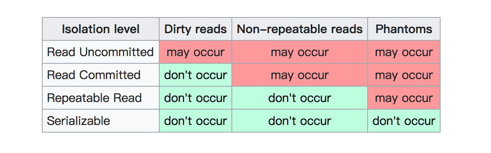

## Q:
```
    Explain MySQL Isolation Level
```

## A:
### Define probably problem in db `Transaction`:
- `Dirty reads`: 
    - when a transaction commits not yet, but you could read the result.
- `Non-repeatable reads`:
    - Do the same query many times in a transaction, but return a different result, just because of other `update` records.
- `Phatom reads`:
    - Do the same query many times in a transaction, but return a different result, just because of other `insert` or `delete` records.

### Isolation levels for solve above problems:


### Note
- MySQL default isolation levels: `Repeatable Read`
- Use below sql script to change default isolation level: 
    - `SET SESSION transaction_isolation='SERIALIZABLE';`
 
## Ref:
- [Transaction in wiki](https://zh.wikipedia.org/wiki/%E4%BA%8B%E5%8B%99%E9%9A%94%E9%9B%A2)
- [資料庫交易的 Isolation](https://medium.com/getamis/database-transaction-isolation-a1e448a7736e)
- [簡介隔離層級](https://openhome.cc/Gossip/HibernateGossip/IsolationLevel.html)
